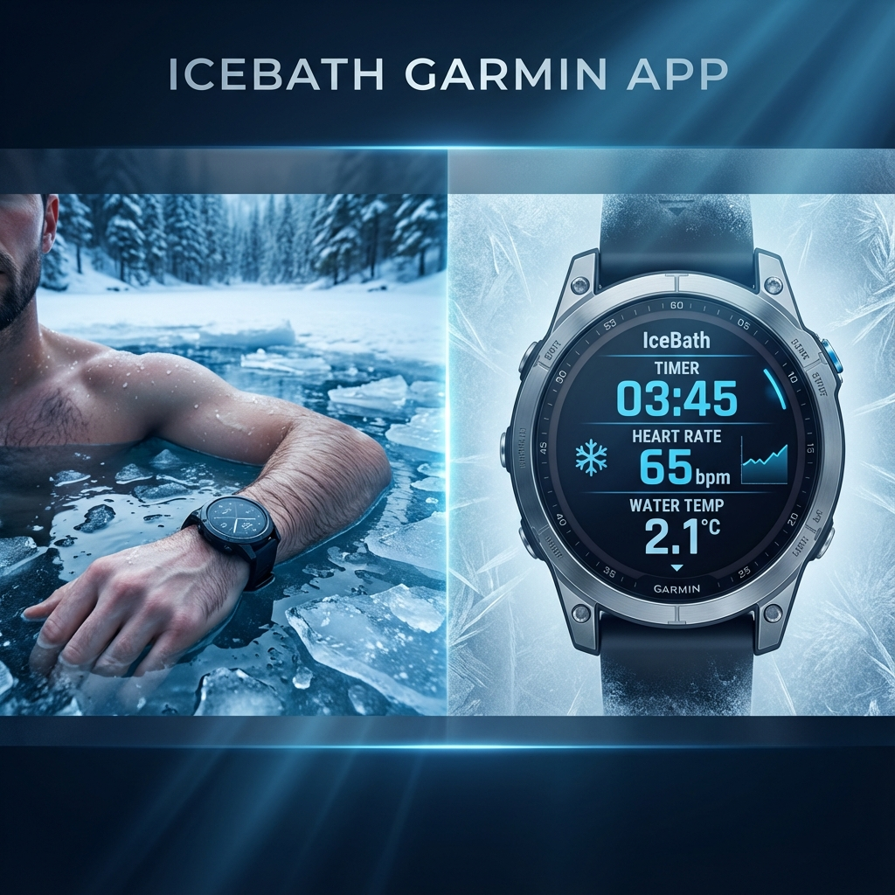

# IceBath ❄️ - Garmin Connect IQ App

**Professional Garmin app for ice bath and cold water swimming activities**




## 🌊 Features

### Core Metrics
- ⏱️ **Duration Tracking** - Real-time activity duration
- ❤️ **Heart Rate** - Live heart rate monitoring
- 🌡️ **Body Temperature** - Hypothermia risk tracking
- 🔥 **Calories** - Enhanced calculation for cold exposure (+40%)
- 📍 **GPS Location** - Records where you entered the water

### Advanced Metrics
- 📊 **HRV** - Heart Rate Variability
- 🫁 **Respiration Rate** - Breathing control
- 💪 **Stress Level** - Garmin stress score
- ⚡ **Body Battery** - Energy level

### Safety Features
- ⚠️ **Smart Alerts** - Audio and vibration alarms at critical values
- 🎯 **Target Duration** - Customizable timer
- 🔔 **Multi-Threshold Control** - Heart rate and temperature limits
- 🚨 **Emergency Warnings** - Hypothermia and bradycardia detection

## 📱 Supported Devices

**66+ Garmin Devices Supported!**

**D2 Aviation Series:**
- D2 Air / Air X10 / Mach 1

**Edge Cycling Series:**
- Edge 540 / 840 / 1040

**Enduro Series:**
- Enduro / Enduro 2 / Enduro 3

**Epix Series:**
- Epix 2 / Epix 2 Pro (42mm / 47mm / 51mm)

**Fenix Series:**
- Fenix 5 / 5S / 5X (Plus variants)
- Fenix 6 / 6S / 6X Pro
- Fenix 7 / 7S / 7X (Pro variants)
- Fenix 8 (43mm / 47mm / 51mm)
- Fenix E

**Forerunner Series:**
- FR 165 / 165M
- FR 255 / 255M / 255S / 255SM
- FR 265 / 265S
- FR 955 / 965 / 970

**MARQ Luxury Series:**
- MARQ 2 / MARQ 2 Aviator

**Venu Series:**
- Venu / Venu 2 / 2 Plus / 2S
- Venu 3 / 3S
- Venu Sq / Sq 2 / Sq 2 Music

**Vivoactive Series:**
- Vivoactive 3 / 3 Music / 3 LTE
- Vivoactive 4 / 4S / 5

*Note: All Garmin devices with body temperature sensor are supported. Total: 66+ models.*

## 🚀 Installation

### Requirements
- Java Runtime Environment (JRE) 1.8+
- Visual Studio Code
- Garmin Connect IQ SDK Manager

### Steps

1. **Download SDK Manager**
   ```bash
   # Download from developer.garmin.com/connect-iq/sdk
   # Open SDK Manager and install SDK
   ```

2. **Install VS Code Extension**
   - Open VS Code
   - Extensions → Search "Monkey C"
   - Install official Garmin extension

3. **Clone the Project**
   ```bash
   git clone https://github.com/yourusername/icebath.git
   cd icebath
   ```

4. **Generate Developer Key**
   - In VS Code: `Cmd + Shift + P`
   - Select "Monkey C: Generate a Developer Key"
   - Save to a secure location

5. **Build the App**
   - In VS Code: `Cmd + Shift + P`
   - Select "Monkey C: Build for Device"

## 🎮 Usage

### Starting an Activity
1. Open the app on your Garmin device
2. Press **SELECT** to start recording
3. Enter cold water and track your metrics

### Button Controls
- **SELECT** - Start/pause recording
- **BACK** - Open menu (Save/Discard/Resume)
- **MENU** - Settings

### Safety Warnings
The app will alert you in the following situations:
- ❤️ Heart rate too high (>160 bpm)
- 💔 Heart rate too low (<40 bpm)
- 🌡️ Low body temperature (<35°C)
- ⏰ Target duration reached

## ⚙️ Settings

Customize the app to your needs:

| Setting | Default | Description |
|---------|---------|-------------|
| Target Duration | 10 minutes | Maximum activity duration |
| Max Heart Rate | 160 bpm | High heart rate threshold |
| Min Heart Rate | 40 bpm | Low heart rate threshold |
| Min Body Temp | 35°C | Hypothermia warning threshold |
| Temperature Unit | Celsius | °C or °F |
| Enable Alerts | On | Audio/vibration alerts |

## 🏗️ Project Structure

```
IceBath/
├── manifest.xml              # App manifest
├── source/
│   ├── IceBathApp.mc        # Main app class
│   ├── IceBathView.mc       # UI view
│   ├── IceBathDelegate.mc   # Input handling
│   ├── DataManager.mc       # Sensor data management
│   ├── SafetyMonitor.mc     # Safety checks
│   └── LocationManager.mc   # GPS location tracking
└── resources/
    ├── strings.xml          # English strings
    ├── strings-tur/
    │   └── strings.xml      # Turkish strings
    ├── settings.xml         # User settings
    └── layouts.xml          # UI layouts
```

## 🔬 Technical Details

### Calorie Calculation
Cold water exposure increases metabolism. The app applies a 40% increase to standard calorie calculation:

```
Cold Water Calories = Standard Calories × 1.4
```

### Safety Algorithm
The app continuously monitors multiple parameters:
1. Heart rate (high/low thresholds)
2. Body temperature (hypothermia risk)
3. Activity duration (overexposure protection)

## ⚠️ Important Warnings

> **CAUTION:** This app is not a medical device. Cold water activities can pose serious health risks. Users engage at their own risk.

**Safety Recommendations:**
- Work with a professional if you're new to cold exposure
- Never enter cold water alone
- Listen to your body and don't push your limits
- Exit immediately if you feel any discomfort
- Consult your doctor if you have chronic conditions

## 🌍 Language Support

- 🇬🇧 **English** (Default)
- 🇹🇷 **Türkçe**

*The app automatically selects language based on your device settings.*

## 📄 License

MIT License - See [LICENSE](LICENSE) file for details.

## 🤝 Contributing

Contributions are welcome! Feel free to submit pull requests.

1. Fork the repository
2. Create a feature branch (`git checkout -b feature/amazing-feature`)
3. Commit your changes (`git commit -m 'Add amazing feature'`)
4. Push to branch (`git push origin feature/amazing-feature`)
5. Open a Pull Request

## 📧 Contact

For questions or suggestions, please open an issue.

## 🙏 Acknowledgments

- Garmin Connect IQ team for the SDK
- Wim Hof method for inspiration
- The entire cold water community

---

**For safe and effective cold water experiences! ❄️🏊‍♂️**

---

*🇹🇷 Türkçe dokümantasyon için [README_TR.md](README_TR.md) dosyasına bakınız.*
